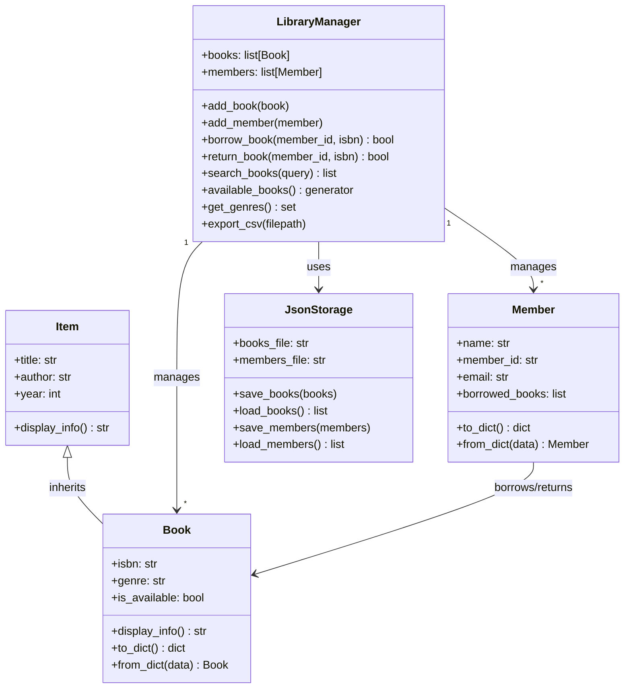

# Library Management System

A collaborative Python project for managing a physical library — books, members, borrowing, and returns.

## Project Structure

```
ITP2_Final/
├── library/
│   ├── models/
│   │   ├── item.py          # Base class: Item
│   │   ├── book.py          # Book extends Item
│   │   └── member.py        # Member class
│   ├── storage/
│   │   └── json_storage.py  # JSON file persistence
│   ├── utils/
│   │   ├── decorators.py    # @log_action decorator
│   │   └── validators.py    # Regex validators (email, ISBN)
│   └── manager.py           # LibraryManager — central association class
├── tests/
│   └── test_library.py      # Unit tests (unittest)
├── data/                    # Auto-created: JSON files, CSV export, log
├── main.py                  # CLI entry point
├── requirements.txt
└── README.md
```

## Class Hierarchy & Architecture



## Logic Flow

```
main.py
  └── LibraryManager (loads data from JsonStorage on startup)
        ├── add_book / add_member  →  save to JSON
        ├── borrow_book            →  sets book.is_available = False
        │                             appends ISBN to member.borrowed_books
        ├── return_book            →  sets book.is_available = True
        │                             removes ISBN from member.borrowed_books
        ├── search_books           →  filter() + lambda on title/author
        ├── available_books        →  generator (yield)
        ├── get_genres             →  set + map()
        └── export_csv             →  writes CSV via csv.DictWriter
```

## Key Python Features Used

| Feature | Where |
|---|---|
| Inheritance | `Book` extends `Item` |
| Association | `LibraryManager` owns `list[Book]` and `list[Member]` |
| Polymorphism | `display_info()` overridden in `Book` |
| Encapsulation | `_storage`, `_find_book()` private in `LibraryManager` |
| Decorator | `@log_action` on borrow/return/add methods |
| Generator | `available_books()` yields books one by one |
| lambda + filter | `search_books()` — filter books by query |
| map | `get_genres()`, `export_csv()` |
| set | `get_genres()` returns unique genres |
| Regex | `is_valid_email()`, `is_valid_isbn()` in validators |
| JSON | `JsonStorage` — save/load books and members |
| CSV | `export_csv()` — export book list |
| os | Directory creation, file existence checks |
| unittest | 13 tests across Book, Member, validators |

## How to Run

```bash
pip install -r requirements.txt
python main.py
```

Run tests:
```bash
python -m pytest tests/
```

## Individual Contributions

| Member | Module | Responsibility |
|---|---|---|
| Chingiz Uraimov | All modules | Full project — models, manager, storage, utils, CLI, tests |
